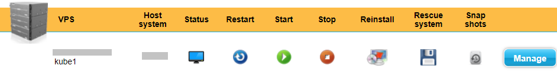
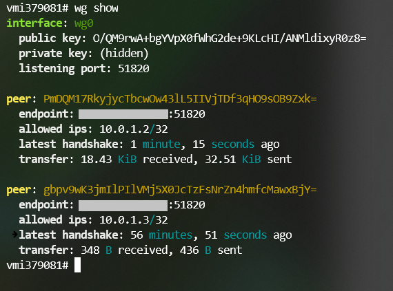
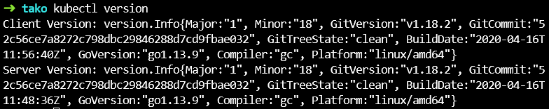
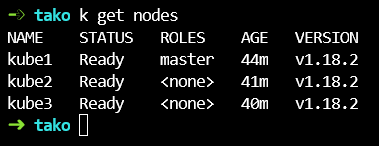
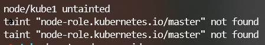
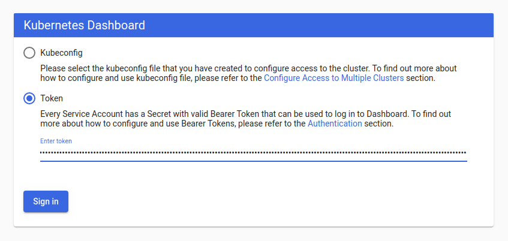
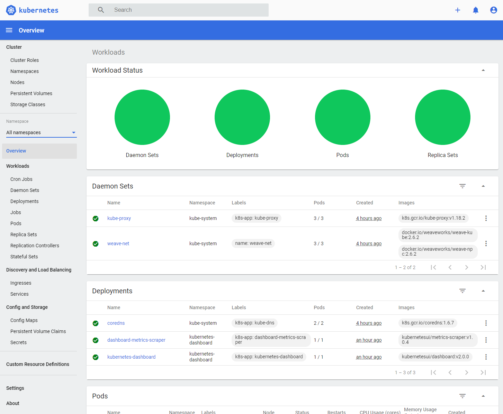
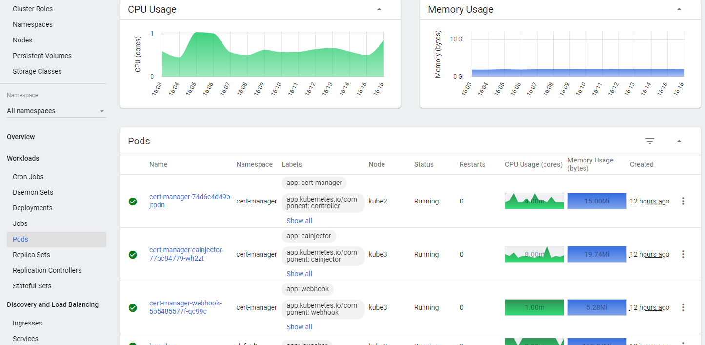

:toc:
:toc-placement!:
:toclevels: 4

= Hobbyist Kubernetes on bare-metal

So while we're in this quarantine with nothing better to do I decided
that I wanted to set up my own Kubernetes cluster. Partly because I
really wanted to learn how to do that and partly because managed cloud
Kubernetes instances are _expensive_! (And I work for RedHat, so at
least I have plenty of access, but they are all limited in a number of
ways)

So I went looking for some guides that could help me set up a Kubernetes
cluster on bare-metal servers with somewhat limited resources. I finally
decided on this guide written by Patrick Stadler.

*Kubernetes clusters for the hobbyist*:
https://github.com/hobby-kube/guide[https://github.com/hobby-kube/guide]

It goes into a lot of detail and often explains the "why" behind the
decisions he made.

But it's obviously it was still going to be quite a complex undertaking.
So I decided to keep a "log" of all the steps I was taking along the
way. And bit by bit this turned somewhat into a guide itself. Still very
much based on Patrick's guide, but different enough to perhaps make it
worthwhile for people to read.

So this is my guide. Wherever possible I've linked to the origin of the
information so you can read things for yourself.

toc::[]

== Setting up the cluster

So next thing to do is getting the hardware, setting up DNS entries and
in general making sure everything is ready for installing Kubernetes.

We'll be getting 3 servers, each with their own public IP address. This
provider doesn't have anything more fancy than that. For the rest of
this guide we'll refer to these servers with the following names and
public and private (VPN) addresses (the public IPs are fake, replace
them with the IP addresses the hosting provider assigns to you):

[cols=",,",options="header",]
|===============================
|Name |Node IP |Node VPN IP
|*Kube1* |11.11.11.111 |10.0.1.1
|*Kube2* |22.22.22.222 |10.0.1.2
|*Kube3* |33.33.33.333 |10.0.1.3
|===============================

I set up DNS records for my domain `example.com` (of course not the real
name) like this:

[cols=",,",options="header",]
|===========================
|Name |Type |Value
|k8s |A |11.11.11.111
|kube1.k8s |A |11.11.11.111
|kube2.k8s |A |22.22.22.222
|kube3.k8s |A |33.33.33.333
|api.k8s |A |11.11.11.111
|apps.k8s |A |11.11.11.111
|*.apps.k8s |CNAME |apps.k8s
|===========================

And I also set the PTR records at the hosting provider:

[cols=",",options="header",]
|===================================
|PTR Record |IP Address
|kube1.k8s.example.com |11.11.11.111
|kube2.k8s.example.com |22.22.22.222
|kube3.k8s.example.com |33.33.33.333
|===================================

So node *Kube1* will be our master server, the "control plane" of our
cluster.

=== Choosing a cloud provider

One of the requirements I had was that I wanted something that could run
"real" applications, I didn't just want a toy to play around with and
throw away afterwards. There are a number of guides for hobbyists (like
the one we'll be following ourselves) but most of them use really tiny
and underpowered nodes for their clusters to help bring down the cost.
They'll make do with 1vCPU and 2GB of memory and 20GB of disk. But I
come from a Java background, 2GB (which Kubernetes itself will need to
use as well) is _nothing_.

So I chose to go with https://contabo.com/?show=vps[Contabo VPS
servers], specifically:

3x “VPS S SSD”

4CPU, 8GB mem, 200GB disk

=== Choosing an operating system

https://releases.ubuntu.com/18.04.4/[Ubuntu 18 LTS]

It’s one of the options they provide and has long term support so that
should be okay.

=== System setup

==== Rename servers

We’ll call our servers “kube1”, “kube2”, …, “kubeN”.

For that we need to go into the “Your services” of our provider and
select “Server Name” from the “Manage” menu:

image:images/servers.png[alt_text]

==== Repartition disks

The provider gives us the disk for each server as one big partition. I
thought this would be okay because Patrick's guide shows us how to use
Rook + Ceph to create distributed block storage on top of plain
directories in the nodes. But it turns out that in newer versions they
have deprecated that functionality and will only work on device
partitions. So the first thing we have to do is repartition the disk.

For that we need to go into the “VPS control” panel and select “Rescue
system”:



And in the next screen we select “SystemRescueCD (recommended)” and
enter a password we’ll need to log in:

image:images/rescue2.png[alt_text]

Hit “Start rescue system”. The system will now reboot into a special
rescue mode that will allow us to repartition the disk.

Now from your shell type the following to connect to the server. If it
doesn't respond just wait a while and try again:

....
ssh root@<NODE_IP>
....

Log in with the user `root` and the password you entered in the previous
step. Once we’re inside we type the following commands:

....
fdisk -l /dev/sda
....

It should show output like this:

....
Disk /dev/sda: 200 GiB, 214748364800 bytes, 419430400 sectors
Units: sectors of 1 * 512 = 512 bytes
Sector size (logical/physical): 512 bytes / 512 bytes
I/O size (minimum/optimal): 512 bytes / 512 bytes
Disklabel type: dos
Disk identifier: 0x95480d74

Device     Boot   Start       End   Sectors   Size Id Type
/dev/sda1  *       2048   1953791   1951744   953M 83 Linux
/dev/sda2       1953792 419428351 417474560 199.1G 83 Linux
....

_If it doesn’t or if `start` / `end` / `sector size` numbers are
different then you should know what you’re doing and definitely *not*
simply copy and paste the commands in the following section!_

Now run:

....
e2fsck -yf /dev/sda2               # (1)
resize2fs /dev/sda2 10G            # (2)
parted /dev/sda resizepart 2 10%   # (3)
parted /dev/sda mkpart primary ext4 41945088s 419428351s # (4)
resize2fs /dev/sda2                # (5)
e2fsck -yf /dev/sda2
....

. Needed to be able to run (2)
. Let's make the filesystem very small, we'll resize up to a proper size
afterwards
. We now shrink the partition to 10%, which should be about 20GB, which
is more than enough for the OS and Kubernetes
. We create a new partition using the remaining free space. But parted
is stupid, it doesn't know how to do that properly. So I used the
information in "Attempt 3: Solution" of
https://blog.hqcodeshop.fi/archives/273-GNU-Parted-Solving-the-dreaded-The-resulting-partition-is-not-properly-aligned-for-best-performance.html[this
article] to calculate the correct numbers. *You CANNOT use these
numbers* unless your disks are exactly the same as in this example. (And
even then you shouldn't blindly trust these numbers)
. Now grow the FS back to full size

We’re done now here, so let’s reboot back into our regular environment,
type:

....
reboot
....

And then we do this for the other two servers too.

==== Login

Now that are servers are partitioned and rebooted we can log into them
to do the rest of the work. I'd suggest opening up 3 terminal windows,
one for each server, because many actions will have to be duplicated
exactly or in a very similart way at least on each server. It's easier
to just copy once and paste 3 times and let them work in parallel. So
type:

....
ssh root@<NODE_NAME>.k8s.example.com
....

But this time use the password sent to you by the hosting provider.

Now the first thing we'll do is set the hostname for each node. So on
each server (look at the names above the panels) execute the
corresponding command.

*Kube1*

....
echo "kube1" > /etc/hostname
....

*Kube2*

....
echo "kube2" > /etc/hostname
....

*Kube3*

....
echo "kube3" > /etc/hostname
....

Let’s also update `/etc/hosts` with our public IP and FQN host name.
Either add the following line or replace the existing line with it:

....
<NODE_IP>       <NODE_NAME>.k8s.example.com
....

And now we reboot again. I'm not sure if this is really necessary, but I
had a couple of times that certain parts of the system kept insisting
that the name of the server wasn't `kubeX` but some name generated by
the hosting provder. Rebooting seemed to help, so just to be sure, type:

....
reboot
....

==== Prepare SSH

Now before logging in again we'll first make that a bit simpler by
copying an SSH key to each node. First we have to generate a
public/private key pair. You might already have one that you can use, in
that case you can skip this step:

....
ssh-keygen -t rsa -b 4096 -C "your_email@example.com"
....

Answer the questions (we can use the defaults) and the key pair will be
created.

Now we’ll copy our public key to a server using the following command
(`NODE_NAME` is one of "kube1", "kube2" or "kube3" of course):

....
ssh-copy-id root@<NODE_NAME>.k8s.example.com
....

It will ask for the password that the provider gave you. Repeat this for
each server.

After that you can log into the servers using SSH:

....
ssh root@<NODE_NAME>.k8s.example.com
....

==== Get rid of swap

The next thing we’ll do is turn off swap which is something Kubernetes
doesn’t like much. Run this command on each server:

....
swapoff -a
....

Now edit the `/etc/fstab` file and remove the line that mentions “swap”.

==== Some miscellaneous bits

Just making sure that some commands further on in this guide will work.
Run these on each node.

....
# Making sure apt-add-repository is installed
apt update
apt install software-properties-common
# IP forwarding needs to be enabled
echo "net.ipv4.ip_forward=1" >> /etc/sysctl.conf
sysctl -p
....

==== Installing Docker

To install and set up Docker we’ll have to run the following on each
node:

....
apt-get install docker.io
....

And set some options by running the following:

....
mkdir -p /etc/systemd/system/docker.service.d
cat > /etc/systemd/system/docker.service.d/10-docker-opts.conf <<EOF
Environment="DOCKER_OPTS=--iptables=false --ip-masq=false"
EOF
cat > /etc/docker/daemon.json <<EOF
{
  "exec-opts": ["native.cgroupdriver=systemd"],
  "log-driver": "json-file",
  "log-opts": {
    "max-size": "100m"
  },
  "storage-driver": "overlay2"
}
EOF
....

And finally:

....
systemctl daemon-reload
systemctl restart docker
systemctl enable docker.service
....

=== Security

==== Firewall

We’ll be following the instruction from the guide to set up the firewall
on each of the servers using
https://wiki.ubuntu.com/UncomplicatedFirewall[UFW]:

....
ufw allow ssh
ufw allow 6443
ufw allow 80
ufw allow 443
ufw default deny incoming
ufw enable
....

==== Wireguard

Now let’s install https://www.wireguard.com/install/[Wireguard] on all
nodes. And because we’re using Ubuntu 18 we have to set up the
repository first.

....
add-apt-repository ppa:wireguard/wireguard
apt install wireguard
....

Now on the each server we’ll create a file with some configuration to
tell WireGuard how to connect to its peers. Run each of these scipts on
their corresponding nodes:

*Kube1*

....
cat > /etc/wireguard/wg0.conf <<EOF
[Interface]
Address = 10.0.1.1
PrivateKey = <PRIVATE_KEY_KUBE1>
ListenPort = 51820

[Peer]
PublicKey = <PUBLIC_KEY_KUBE2>
AllowedIps = 10.0.1.2/32
Endpoint = 22.22.22.222:51820

[Peer]
PublicKey = <PUBLIC_KEY_KUBE3>
AllowedIps = 10.0.1.3/32
Endpoint = 33.33.33.333:51820
EOF
....

*Kube2*

....
cat > /etc/wireguard/wg0.conf <<EOF
[Interface]
Address = 10.0.1.2
PrivateKey = <PRIVATE_KEY_KUBE2>
ListenPort = 51820

[Peer]
PublicKey = <PUBLIC_KEY_KUBE1>
AllowedIps = 10.0.1.1/32
Endpoint = 11.11.11.111:51820

[Peer]
PublicKey = <PUBLIC_KEY_KUBE3>
AllowedIps = 10.0.1.3/32
Endpoint = 33.33.33.333:51820
EOF
....

*Kube3*

....
cat > /etc/wireguard/wg0.conf <<EOF
[Interface]
Address = 10.0.1.3
PrivateKey = <PRIVATE_KEY_KUBE3>
ListenPort = 51820

[Peer]
PublicKey = <PUBLIC_KEY_KUBE1>
AllowedIps = 10.0.1.1/32
Endpoint = 11.11.11.111:51820

[Peer]
PublicKey = <PUBLIC_KEY_KUBE2>
AllowedIps = 10.0.1.2/32
Endpoint = 22.22.22.222:51820
EOF
....

But as you can see there are some values missing. For that we run this
little script on *Kube1*:

....
for i in 1 2 3; do
  private_key=$(wg genkey)
  public_key=$(echo $private_key | wg pubkey)
  echo "<PRIVATE_KEY_KUBE$i> = $private_key"
  echo "<PUBLIC_KEY_KUBE$i> =  $public_key"
done
....

This gives us a nice list of public and private keys for each node.
Something like this:

....
<PRIVATE_KEY_KUBE1> = MDQgiDU7yPxFwKD9Y1YCYSX+tb4ZGxglXYWLPYlBcm4=
<PUBLIC_KEY_KUBE1> =  oVgxStbC250Mzyl3YJpC0KX0Vo16GafewL44TqwvogM=
<PRIVATE_KEY_KUBE2> = oLHoiKMShKKniUZ6socbBsPQlS9qWkGKCtH6bzdPYEM=
<PUBLIC_KEY_KUBE2> =  bx3qlTronTKYjFNH0JwjbH6tIvUqFeKoMD+5q8pwFXU=
<PRIVATE_KEY_KUBE3> = wLmym9VIrJjHdd97ddoA2W+Kmk5chPRftb/+WyzWFEc=
<PUBLIC_KEY_KUBE3> =  5w1VmcZ+Jh1ews9N2XDP6RnqNzfLY57SQWFuaUUgQ3E=
....

(Don't use these values, use your own!)

Now we have to edit each of those files and copy & paste the actual
values.

Having done that we must update the firewall rules to allow Wireguard
VPN communication:

....
ufw allow in on eth0 to any port 51820
ufw allow in on wg0
ufw reload
....

And finally we start Wireguard and make sure it will be started in the
future as well:

....
systemctl enable --now wg-quick@wg0
....

If you want you can check if everything is configured correctly by
running the following on any of the nodes:

....
wg show
....

It should show something like:



And finally we add some more lines to `/etc/hosts` to make it easier for
us to refer to each node from any node (not sure if it’s required to be
honest, but it's what I did). Just run the following on each node:

....
cat >> /etc/hosts <<EOF
10.0.1.1        kube1
10.0.1.2        kube2
10.0.1.3        kube3
EOF
....

== Installing K8s (using `kubeadm`)

=== Etcd

Execute the following to download and install https://etcd.io/[etcd] on
each server:

....
export ETCD_VERSION="v3.4.7"
mkdir -p /opt/etcd
curl -L https://storage.googleapis.com/etcd/${ETCD_VERSION}/etcd-${ETCD_VERSION}-linux-amd64.tar.gz \
  -o /opt/etcd-${ETCD_VERSION}-linux-amd64.tar.gz
tar xzvf /opt/etcd-${ETCD_VERSION}-linux-amd64.tar.gz -C /opt/etcd --strip-components=1
....

Now on the each server we’ll create a file so `etcd `will start up at
boot time:

*Kube1*

....
cat > /etc/systemd/system/etcd.service <<EOF
[Unit]
Description=etcd
After=network.target wg-quick@wg0.service

[Service]
Type=notify
ExecStart=/opt/etcd/etcd --name kube1 \
  --data-dir /var/lib/etcd \
  --listen-client-urls "http://10.0.1.1:2379,http://localhost:2379" \
  --advertise-client-urls "http://10.0.1.1:2379" \
  --listen-peer-urls "http://10.0.1.1:2380" \
  --initial-cluster "kube1=http://10.0.1.1:2380,kube2=http://10.0.1.2:2380,kube3=http://10.0.1.3:2380" \
  --initial-advertise-peer-urls "http://10.0.1.1:2380" \
  --heartbeat-interval 200 \
  --election-timeout 5000
Restart=always
RestartSec=5
TimeoutStartSec=0
StartLimitInterval=0

[Install]
WantedBy=multi-user.target
EOF
systemctl enable --now etcd.service
....

*Kube2*

....
cat > /etc/systemd/system/etcd.service <<EOF
[Unit]
Description=etcd
After=network.target wg-quick@wg0.service

[Service]
Type=notify
ExecStart=/opt/etcd/etcd --name kube2 \
  --data-dir /var/lib/etcd \
  --listen-client-urls "http://10.0.1.2:2379,http://localhost:2379" \
  --advertise-client-urls "http://10.0.1.2:2379" \
  --listen-peer-urls "http://10.0.1.2:2380" \
  --initial-cluster "kube1=http://10.0.1.1:2380,kube2=http://10.0.1.2:2380,kube3=http://10.0.1.3:2380" \
  --initial-advertise-peer-urls "http://10.0.1.2:2380" \
  --heartbeat-interval 200 \
  --election-timeout 5000
Restart=always
RestartSec=5
TimeoutStartSec=0
StartLimitInterval=0

[Install]
WantedBy=multi-user.target
EOF
systemctl enable --now etcd.service
....

*Kube3*

....
cat > /etc/systemd/system/etcd.service <<EOF
[Unit]
Description=etcd
After=network.target wg-quick@wg0.service

[Service]
Type=notify
ExecStart=/opt/etcd/etcd --name kube3 \
  --data-dir /var/lib/etcd \
  --listen-client-urls "http://10.0.1.3:2379,http://localhost:2379" \
  --advertise-client-urls "http://10.0.1.3:2379" \
  --listen-peer-urls "http://10.0.1.3:2380" \
  --initial-cluster "kube1=http://10.0.1.1:2380,kube2=http://10.0.1.2:2380,kube3=http://10.0.1.3:2380" \
  --initial-advertise-peer-urls "http://10.0.1.3:2380" \
  --heartbeat-interval 200 \
  --election-timeout 5000
Restart=always
RestartSec=5
TimeoutStartSec=0
StartLimitInterval=0

[Install]
WantedBy=multi-user.target
EOF
systemctl enable --now etcd.service
....

We can test it all works correctly by running:

....
/opt/etcd/etcdctl member list
....

=== Kubernetes

Let’s install the packages necessary to run Kubernetes. We do this by running the following on all nodes:

....
curl -s https://packages.cloud.google.com/apt/doc/apt-key.gpg | apt-key add -
cat <<EOF | tee /etc/apt/sources.list.d/kubernetes.list
deb https://apt.kubernetes.io/ kubernetes-xenial main
EOF
apt-get update
apt-get install -y kubelet kubeadm kubectl
apt-mark hold kubelet kubeadm kubectl
....

And now on *Kube1*, the master node, we create a configuration file, let’s call it
master-config.yml (just create it anywhere) with the necessary settings for our cluster:

....
apiVersion: kubeadm.k8s.io/v1beta2
kind: InitConfiguration
localAPIEndpoint:
  advertiseAddress: 10.0.1.1
  bindPort: 6443
nodeRegistration:
  name: kube1
---
apiVersion: kubeadm.k8s.io/v1beta2
kind: ClusterConfiguration
certificatesDir: /etc/kubernetes/pki
apiServer:
  certSANs:
  - 11.11.11.111
  - api.k8s.example.com
etcd:
  external:
    endpoints:
    - http://10.0.1.1:2379
    - http://10.0.1.2:2379
    - http://10.0.1.3:2379
clusterName: "my-first-cluster-name"
....

And finally let’s create our Kubernetes Control Plane, our master node!

....
kubeadm init --config master-config.yml --node-name master
....

*IMPORTANT*: copy the “kubeadm join ….” command that appears at the end
of kubeadm init output and keep it safe somewhere, we’ll need it for
adding the other nodes to the cluster!

Now we create a symlink to the kube config so kubectl will work:

....
mkdir -p $HOME/.kube
ln -s /etc/kubernetes/admin.conf $HOME/.kube/config
....

We can even do this remotely, from our comfortable chair at home, on any
computer not inside our cluster, by running:

....
scp root@kube1.k8s.example.com:/root/.kube/config ~/.kube
....

If we’ve got `kubectl` installed we can now simply use it, like this:

....
kubectl config set-cluster my-first-cluster-name --server=https://api.k8s.example.com:6443
kubectl version
....

Which should give something like:



*Yay!!*

So let’s continue because we’re not ready yet.

Now we must set up our pod network, we’ll be using
https://www.weave.works/oss/net/[Weave Net]. So run this on *Kube1*:

....
kubectl apply -f "https://cloud.weave.works/k8s/net?k8s-version=$(kubectl version | base64 | tr -d '\n')"
....

After a short while all kinds of new network interfaces should appear.
You can check this by running `ip address`.

Now we need add some persistent routes without which Weave won’t use the
WireGuard VPN tunnels and we also need to allow incoming traffic on the
Weave network:

*Kube1*

....
cat > /etc/systemd/system/overlay-route.service <<EOF
[Unit]
Description=Overlay network route for WireGuard
After=wg-quick@wg0.service

[Service]
Type=oneshot
User=root
ExecStart=/sbin/ip route add 10.96.0.0/16 dev wg0 src 10.0.1.1

[Install]
WantedBy=multi-user.target
EOF
systemctl enable --now overlay-route.service
ufw allow in on weave
ufw reload
....

*Kube2*

....
cat > /etc/systemd/system/overlay-route.service <<EOF
[Unit]
Description=Overlay network route for WireGuard
After=wg-quick@wg0.service

[Service]
Type=oneshot
User=root
ExecStart=/sbin/ip route add 10.96.0.0/16 dev wg0 src 10.0.1.2

[Install]
WantedBy=multi-user.target
EOF
systemctl enable --now overlay-route.service
ufw allow in on weave
ufw reload
....

*Kube3*

....
cat > /etc/systemd/system/overlay-route.service <<EOF
[Unit]
Description=Overlay network route for WireGuard
After=wg-quick@wg0.service

[Service]
Type=oneshot
User=root
ExecStart=/sbin/ip route add 10.96.0.0/16 dev wg0 src 10.0.1.3

[Install]
WantedBy=multi-user.target
EOF
systemctl enable --now overlay-route.service
ufw allow in on weave
ufw reload
....

==== Joining the worker nodes

Now it’s time to add the other nodes to our cluster!

First we make sure the node kubelets
https://www.google.com/url?q=https://propellered.com/posts/kubernetes/&sa=D&ust=1588093046065000&usg=AFQjCNEc0ATAwKTjOLyP4qNozVkJWRbS1Q[get
initialized with the correct internal ip] by running the following on
the appropriate nodes:

*Kube1*

....
cat > /etc/default/kubelet <<EOF
KUBELET_EXTRA_ARGS=--node-ip=10.0.1.1
EOF
....

*Kube2*

....
cat > /etc/default/kubelet <<EOF
KUBELET_EXTRA_ARGS=--node-ip=10.0.1.2
EOF
....

*Kube3*

....
cat > /etc/default/kubelet <<EOF
KUBELET_EXTRA_ARGS=--node-ip=10.0.1.3
EOF
....

And now we run the `kubeadm join` command we copied earlier on each of the remaining nodes.
It will look like this but I've added `--node-name` to it which we’ll set to `kube2` and `kube3`
on the respective nodes:

....
kubeadm join 10.0.1.1:6443 --token <TOKEN> \
--discovery-token-ca-cert-hash sha256:<VERY_LONG_TOKEN> \
--node-name <NODE_NAME>
....

And all nodes should now be up and running! You can run this to check
the nodes:

....
kubectl get nodes
....

Which should look somewhat like this:



All nodes should show `Ready`.

Let’s also take a look at the pods that are running because that’s
another good way to see if everything is okay:

....
kubectl get pods -A
....

Which should look somewhat like this:

image:images/kubectl_getpods.png[alt_text]

When all pods show “Running” everything is good.

*Yay! We’ve done it!*

==== Troubleshooting

If at any time you feel the need to start all over you can run the
following on each node which will get rid of the local Kubernetes setup
(either from “init” or “join”):

....
kubeadm reset
....

And then on the master node (well actually you can do it on any node)
you can run the following to wipe all data from `etcd` (be careful,
there’s no confirmation prompt!):

....
ETCDCTL_API=3 /opt/etcd/etcdctl del "" --from-key=true
....

And finally get rid of the CNI configuration:

....
rm -rf /etc/cni
....

==== Removing taint

By default our cluster won’t schedule any work on the master node,
reserving it for system applications for security reasons. In our case
we don’t really care about that and we sure don’t want all those
resources to go unused! So run the following to allow pods to run
anywhere (taken from
https://kubernetes.io/docs/setup/production-environment/tools/kubeadm/create-cluster-kubeadm/#control-plane-node-isolation[Kubernetes
docs]):

....
kubectl taint nodes --all node-role.kubernetes.io/master-
....

You should see something like:



=== Dashboard

Now let’s install the
https://github.com/kubernetes/dashboard/blob/master/README.md[Kubernetes
Dashboard], a Web UI you can use to inspect and manage most of the
Kubernetes internals:

....
kubectl apply -f https://raw.githubusercontent.com/kubernetes/dashboard/v2.0.0/aio/deploy/recommended.yaml
....

But we’ll need to
https://github.com/kubernetes/dashboard/blob/master/docs/user/access-control/creating-sample-user.md[create
a user] to be able to log into the UI. Just run the following that will
apply the necessary settings:

....
cat > dashboard-admin-user.yml <<EOF
apiVersion: v1
kind: ServiceAccount
metadata:
  name: admin-user
  namespace: kubernetes-dashboard
---
apiVersion: rbac.authorization.k8s.io/v1
kind: ClusterRoleBinding
metadata:
  name: admin-user
roleRef:
  apiGroup: rbac.authorization.k8s.io
  kind: ClusterRole
  name: cluster-admin
subjects:
- kind: ServiceAccount
  name: admin-user
  namespace: kubernetes-dashboard
EOF
kubectl apply -f dashboard-admin-user.yml
....

Using the following command you can now get the token to log in with:

....
kubectl -n kubernetes-dashboard get secret $(kubectl -n kubernetes-dashboard get secret | grep admin-user | awk '{print $1}') -o jsonpath='{.data.token}'
....

Because we don’t have a proper way yet to access the cluster from “the
outside” we’ll make use of a temporary proxy to connect to our new
dashboard. Run the following comamnd in a terminal on a computer with a
browser and where you have set up kubectl:

....
kubectl proxy
....

We can now access the cluster’s API server which is where the dashboard
is located:

....
http://localhost:8001/api/v1/namespaces/kubernetes-dashboard/services/https:kubernetes-dashboard:/proxy/
....

This will show a page like this:



Where we can paste the token we obtained before. Et voilá, we have
access! You should see something like this:



=== Helm

Helm is a program for installing applications on Kubernetes, a bit like
package managers like APT, DNF, Brew, etc. We’ll be using it in some of
the next sections so we need to install it. You can find the
instructions here (make sure to install version 3+):

https://helm.sh/docs/intro/install/[https://helm.sh/docs/intro/install/]

Make sure you've installed the default stable repository:

```
helm repo add stable https://kubernetes-charts.storage.googleapis.com/
helm repo update
```

=== Metrics Server

The Dashboard can even show us nice graphs about current usage and such,
and for that we need to install the
https://github.com/kubernetes-incubator/metrics-server[Metrics Server].
We´re going to use the Helm tool we just installed for that. First we add the necessary
Helm repository:

```
helm repo add bitnami https://charts.bitnami.com/bitnami
helm repo update
```

And then we do the actuall installation:

....
helm install \
  -n kube-system \
  metrics-server \
  --set rbac.create=true \
  --set apiService.create=true \
  --set extraArgs.kubelet-preferred-address-types=InternalIP,\
extraArgs.kubelet-insecure-tls=true \
  bitnami/metrics-server
....

(The `extraArgs` settings were necessary in my case or it just wouldn't
connect to any of the nodes. The
https://github.com/bitnami/charts/tree/master/bitnami/metrics-server/[installation
docs] don't really mention it, but see comments on
https://github.com/kubernetes-sigs/metrics-server/issues/167#issuecomment-469914560[this
issue] for more information)

After a couple of minutes the Dashboard should update its interface and
you’ll start to see things like this:



=== Ingress

So far we haven’t really handled how we will expose our services to the
outside world. We only have a couple of static IP addresses and opening
ports and remembering what IP:port combination works for what service
wouldn’t be very user-friendly. It would also be very inflexible.

So that’s what https://github.com/kubernetes/ingress-nginx[NGINX Ingress
Controller] is for, it will allow us to associate hostnames with our
services. We’ve already set up a wild-card *.apps.k8s.example.com
pointing to our *Kube1* node which means that we can use any subdomain
for our services.

It _does_ mean that all outside traffic comes in on a single node,
there’s no load balancing possible here. But realistically our cluster
is never going to be used for high-traffic services, so that’s okay.

It also means that we have to make sure that this ingress controller is
not scheduled like any other service but that it’s _always_ started on
*Kube1*. Again we will use Helm to install things but this time the
configuration is a bit too complex to just pass on the command line, so
first we’ll make a values file:

....
cat > helm-ingress-values.yml <<EOF
controller:
  tolerations:
  - key: node-role.kubernetes.io/master
    operator: Equal
    effect: NoSchedule
  affinity:
    nodeAffinity:
      requiredDuringSchedulingIgnoredDuringExecution:
        nodeSelectorTerms:
        - matchExpressions:
          - key: node-role.kubernetes.io/master
            operator: Exists
  hostNetwork: true
  dnsPolicy: ClusterFirstWithHostNet
  reportNodeInternalIp: true
EOF
....

And now we do the actual installation:

....
helm install \
  --namespace ingress \
  --create-namespace \
  ingress \
  stable/nginx-ingress \
  -f helm-ingress-values.xml
....

=== Cert Manager

Now that people can access our apps from the outside world we will want
to protect those communications with proper encryption. For that we’ll
be installing
https://cert-manager.io/docs/installation/kubernetes/[cert-manager] and
configure Letsencrypt support so we can generate certificates on-the-fly
for our apps.

First we need to do some setup:

....
kubectl apply --validate=false -f https://github.com/jetstack/cert-manager/releases/download/v0.14.2/cert-manager.crds.yaml
....

Then we add the necessary Helm repository:

....
helm repo add jetstack https://charts.jetstack.io
helm repo update
....

And finally we install the certificate manager:

....
helm install \
  cert-manager jetstack/cert-manager \
  --namespace cert-manager \
  --create-namespace \
  --version v0.14.2
....

Now we just need to tell it where to get the certificates from:

....
cat > letsencrypt-issuer.yml <<EOF
apiVersion: cert-manager.io/v1alpha2
kind: ClusterIssuer
metadata:
  name: letsencrypt-testing
  namespace: cert-manager
spec:
  acme:
    # The ACME server URL
    server: https://acme-staging-v02.api.letsencrypt.org/directory
    # Email address used for ACME registration
    email: tako@example.com
    # Name of a secret used to store the ACME account private key
    privateKeySecretRef:
      name: letsencrypt-testing
    # Enable the HTTP-01 challenge provider
    solvers:
    - http01:
        ingress:
          class:  nginx
---
apiVersion: cert-manager.io/v1alpha2
kind: ClusterIssuer
metadata:
  name: letsencrypt
  namespace: cert-manager
spec:
  acme:
    # The ACME server URL
    server: https://acme-v02.api.letsencrypt.org/directory
    # Email address used for ACME registration
    email: tako@example.com
    # Name of a secret used to store the ACME account private key
    privateKeySecretRef:
      name: letsencrypt
    # Enable the HTTP-01 challenge provider
    solvers:
    - http01:
        ingress:
          class:  nginx
EOF
kubectl apply -f letsencrypt-issuer.yml
....

This actually configures two different issuers, one called
“letsencrypt-testing” and the other “letsencrypt”. The difference is
that the former always returns the same fake certificate which can be
used during testing, while the latter actually creates a proper unique
certificate. This is to make sure people don’t go around creating loads
of throw-away certificates.

You can look at the documentation
https://cert-manager.io/docs/installation/kubernetes/#verifying-the-installation[here]
,
https://cert-manager.io/docs/tutorials/acme/ingress/#step-7-deploy-a-tls-ingress-resource[here]
and
https://www.digitalocean.com/community/tutorials/how-to-set-up-an-nginx-ingress-with-cert-manager-on-digitalocean-kubernetes[here]
to verify that everything is working correctly.

=== Distributed Storage

The final piece to finish our Kubernetes puzzle is storage. Without that
there’s a lot of apps we couldn’t run. So we’re going to use all the
unused space we have on our nodes, those 180GB partitions we made in the
beginning. Although that setup would never do for production purposes it
is enough for the semi-serious hobbyist.

There are all kinds of storage solutions out there, but not many allow
for these bare-metal setups like we have here. The guide we’re following
uses https://rook.io/[Rook] directly in folders on an already formatted
disk. So I thought this would be perfect for our situation where we have
but a single 200GB disk. Only it turns out that in the newest versions
they deprecated that functionality. Which is why one of the first things
we did was repartition our disk so that, instead of using folders, we
could assign an entire partition exclusively to Rook (well actually
https://rook.io/docs/rook/v1.3/ceph-storage.html[Ceph], but that’s
another story).

==== Set up the Cluster

First we add the necessary Helm repository:

....
helm repo add rook-release https://charts.rook.io/release
helm repo update
....

Then we install the Rook Operator:

....
helm install \
  --namespace rook-ceph \
  --create-namespace \
  rook-ceph \
  rook-release/rook-ceph
....

And then we create our cluster (a minified version of
https://github.com/rook/rook/blob/release-1.3/cluster/examples/kubernetes/ceph/cluster.yaml[this
original] adjusted for our use-case):

....
cat > rook-ceph-cluster.yml <<EOF
apiVersion: ceph.rook.io/v1
kind: CephCluster
metadata:
  name: rook-ceph
  namespace: rook-ceph
spec:
  cephVersion:
    image: ceph/ceph:v14.2.9
    allowUnsupported: false
  dataDirHostPath: /var/lib/rook
  skipUpgradeChecks: false
  continueUpgradeAfterChecksEvenIfNotHealthy: false
  mon:
    count: 3
    allowMultiplePerNode: false
  dashboard:
    enabled: true
    # serve the dashboard under a subpath (useful when you are accessing the dashboard via a reverse proxy)
    # urlPrefix: /ceph-dashboard
    # port: 8443
    ssl: true
  monitoring:
    enabled: false
    rulesNamespace: rook-ceph
  network:
  rbdMirroring:
    workers: 0
  crashCollector:
    disable: false
  cleanupPolicy:
    deleteDataDirOnHosts: ""
  annotations:
  resources:
  removeOSDsIfOutAndSafeToRemove: false
  storage:
    useAllNodes: false
    useAllDevices: false
    config:
    nodes:
    - name: "kube1"
      devices:
      - name: "sda3"
    - name: "kube2"
      devices:
      - name: "sda3"
    - name: "kube3"
      devices:
      - name: "sda3"
  disruptionManagement:
    managePodBudgets: false
    osdMaintenanceTimeout: 30
    manageMachineDisruptionBudgets: false
    machineDisruptionBudgetNamespace: openshift-machine-api
EOF
kubectl apply -f rook-ceph-cluster.yml
....

If you want to see if the cluster is up and running correctly you can
install a “toolbox” with some utilities to check the cluster’s status
and health and such. Install it with:

....
kubectl apply -f https://raw.githubusercontent.com/rook/rook/release-1.3/cluster/examples/kubernetes/ceph/toolbox.yaml
....

And connect to it by running:

....
kubectl -n rook-ceph exec -it $(kubectl -n rook-ceph get pod -l "app=rook-ceph-tools" -o jsonpath='{.items[0].metadata.name}') -- bash
....

In the shell that you get you can run commands like:

....
ceph status
ceph osd status
ceph df
rados df
....

Especially `ceph status` is useful to check everything went okay, its
output should look something like this:

....
  cluster:
    id:     ab8bebf3-e8b0-4340-b692-0fe8efce8ff5
    health: HEALTH_OK

  services:
    mon: 3 daemons, quorum a,b,c (age 106m)
    mgr: a(active, since 48s)
    osd: 3 osds: 3 up (since 20s), 3 in (since 20s)

  data:
    pools:   0 pools, 0 pgs
    objects: 0 objects, 0 B
    usage:   3.0 GiB used, 537 GiB / 540 GiB avail
    pgs:
....

If you don’t get `HEALTH_OK` check
https://rook.io/docs/rook/v1.3/ceph-common-issues.html[Ceph common
issues] for possible solutions.

==== Provision Storage

And finally we need to define a store class. As far as I understand it
what we have so far is just a big bag of bits and no way to access them.
The storage class defines the way (the protocal? the API?) we want to
manage those bits with. In this case we're using
https://rook.io/docs/rook/v1.3/ceph-block.html[Block Storage] which,
AFAIU, shows up as a block device or disk to Pods. These are private to
a Pod and can't / won't be shared. But they are persistent so if a Pod
gets restarted it's data is still there.

To install this storage class and block pool we simply run:

....
cat > rook-ceph-storageclass.yml <<EOF
apiVersion: ceph.rook.io/v1
kind: CephBlockPool
metadata:
  name: replicapool
  namespace: rook-ceph
spec:
  failureDomain: host
  replicated:
    size: 2
    requireSafeReplicaSize: true
---
apiVersion: storage.k8s.io/v1
kind: StorageClass
metadata:
   name: rook-ceph-block
provisioner: rook-ceph.rbd.csi.ceph.com
parameters:
    clusterID: rook-ceph
    pool: replicapool
    imageFormat: "2"
    imageFeatures: layering
    csi.storage.k8s.io/provisioner-secret-name: rook-csi-rbd-provisioner
    csi.storage.k8s.io/provisioner-secret-namespace: rook-ceph
    csi.storage.k8s.io/controller-expand-secret-name: rook-csi-rbd-provisioner
    csi.storage.k8s.io/controller-expand-secret-namespace: rook-ceph
    csi.storage.k8s.io/node-stage-secret-name: rook-csi-rbd-node
    csi.storage.k8s.io/node-stage-secret-namespace: rook-ceph
allowVolumeExpansion: true
reclaimPolicy: Delete
EOF
kubectl apply -f rook-ceph-storageclass.yml
....

There are other storate classes provided by Ceph:
https://rook.io/docs/rook/v1.3/ceph-object.html[Object Storage] (which
is like Amazon S3) and a
https://rook.io/docs/rook/v1.3/ceph-filesystem.html[Shared Filesystem].
We won't discuss those here.

==== Ceph Dashboard

There’s also a Dashboard you can access for this cluster. All the
documentation can be found
https://rook.io/docs/rook/v1.3/ceph-dashboard.html[here]. The “Enable
the Ceph Dashboard” and “Configure the Dashboard” sections can be
skipped because we already did all that. For making the dashboard
publically available we can apply this Ingress:

....
cat > ceph-dashboard-ingress.yml <<EOF
apiVersion: extensions/v1beta1
kind: Ingress
metadata:
  name: rook-ceph-mgr-dashboard
  namespace: rook-ceph
  annotations:
    kubernetes.io/ingress.class: "nginx"
    kubernetes.io/tls-acme: "true"
    # This will use a Fake certificate for testing.
    # Once you're ready to put your service into production
    # change the value below to "letsencrypt" and a real
    # certificate will be provided.
    cert-manager.io/issuer: "letsencrypt-testing"
    nginx.ingress.kubernetes.io/backend-protocol: "HTTPS"
    nginx.ingress.kubernetes.io/server-snippet: |
      proxy_ssl_verify off;
spec:
  tls:
   - hosts:
     - rook-ceph-mgr-dashboard.apps.k8s.example.com
     secretName: rook-ceph-mgr-dashboard-tls
  rules:
  - host: rook-ceph-mgr-dashboard.apps.k8s.example.com
    http:
      paths:
      - path: /
        backend:
          serviceName: rook-ceph-mgr-dashboard
          servicePort: https-dashboard
EOF
kubectl apply -f ceph-dashboard-ingress.yml
....

_TODO: figure out why the browser still keeps complaining about an
invalid license. I think it's because the internal service also uses TLS
but with a self-signed certificate. Pehaps we should try turning that
off and trust nobody will be able to access that internal service from
the outside anyway_

=== OAuth2

_WARNING: This part is still a work in progress. It works but I'm not really happy with it._

With the final piece installed it doesn't mean we're finished of course. There's
still a lot of other things we could install. One very important part is authentication
and authorization. If our cluster is publically accessible we don't want to just let
anyone inside!

For now we're going to install a fairly simple component called
https://oauth2-proxy.github.io/oauth2-proxy/[oauth2-proxy]. I basically followed
the instructions from this article
https://www.digitalocean.com/community/tutorials/how-to-protect-private-kubernetes-services-behind-a-github-login-with-oauth2_proxy[How to Protect Private Kubernetes Services Behind a GitHub Login with oauth2_proxy].
But some minor things had to be changed to make things work.

For this guide I'm going to use GitHub authentication because it's an account that most
people I'd give acces to my cluster to will have and the setup is really easy. I got
stuck on the Google authentication setup because the docs are out-of-date and I wasn't
able to make things work (issue opened, will update the guide if I get things to work in
the future).

Let's first start by creating a namespace (normally I do this as part of the Helm install
command, but here I want to make sure some other things are set up first, so we do
it manually):

```
kubectl create ns oauth2
```

See https://oauth2-proxy.github.io/oauth2-proxy/auth-configuration#github-auth-provider[GitHub Auth Provider]
for instructions on how to set up a GitHub OAuth application. Make sure you copy the Client ID
and Client Secret for use in the next step.

We also need a Cookie which you can generate here: https://generate.plus/en/base64

Next we need to create a secret holding those values:

```
kubectl -n oauth2 create secret generic oauth2-proxy-creds \
  --from-literal=cookie-secret=<GENERATED_COOKIE> \
  --from-literal=client-id=<GITHUB_CLIENT_ID> \
  --from-literal=client-secret=<GITHUB_CLIENT_SECRET>
```

Now we need to create our configuration file, eg `oauth2-proxy-helm-values.yml`:

```
config:
  existingSecret: oauth2-proxy-creds

extraArgs:
  whitelist-domain: .apps.k8s.example.com
  cookie-domain: .apps.k8s.example.com
  provider: github

authenticatedEmailsFile:
  enabled: true
  restricted_access: |-
    tako@example.com
    someone@example.com
    example@gmail.com

ingress:
  enabled: true
  path: /
  hosts:
    - auth.apps.k8s.example.com
  annotations:
    kubernetes.io/ingress.class: nginx
    cert-manager.io/cluster-issuer: letsencrypt
  tls:
    - secretName: oauth2-proxy-https-cert
      hosts:
        - auth.apps.k8s.example.com
```

Make sure to use the host names particular to your use-case. The email addresses in
the `restricted_access` option are the people that will be granted access.

Now let's install the https://hub.helm.sh/charts/stable/oauth2-proxy[oauth2-proxy chart] itself:

```
helm install -n oath2 oath2-proxy stable/oauth2-proxy -f oauth2-proxy-helm-values.yml
```
