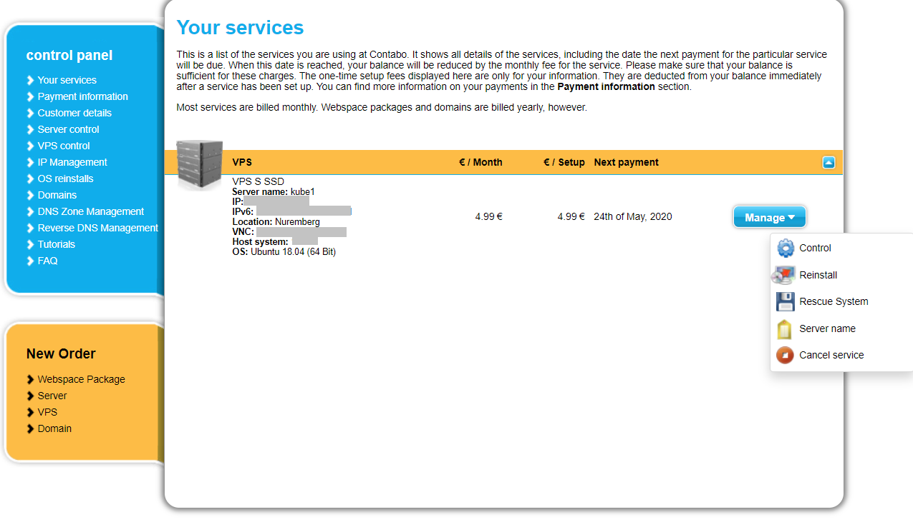
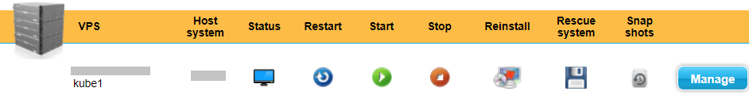
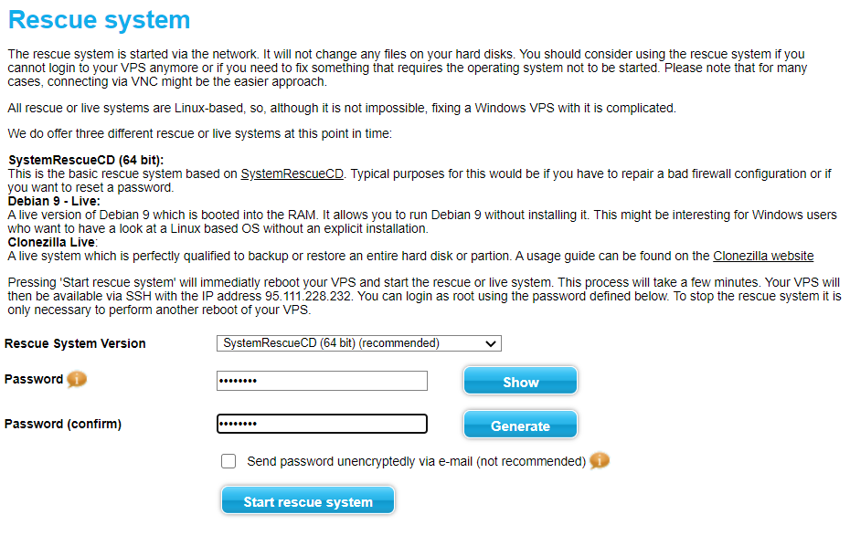

= Setting up the servers

So the first thing to do is getting the hardware, setting up DNS entries
and in general making sure everything is ready for installing Kubernetes.

We'll be getting 3 servers, each with their own public IP address. This
provider doesn't have anything more fancy than that. For the rest of
this guide we'll refer to these servers with the following names and
public and private (VPN) addresses (the public IPs are fake, replace
them with the IP addresses the hosting provider assigns to you):

[cols=",,",options="header",]
|===============================
|Name |Node IP |Node VPN IP
|*Kube1* |11.11.11.111 |10.0.1.1
|*Kube2* |22.22.22.222 |10.0.1.2
|*Kube3* |33.33.33.333 |10.0.1.3
|===============================

I set up DNS records for my domain `example.com` (of course not the real
name) like this:

[cols=",,",options="header",]
|===========================
|Name |Type |Value
|k8s |A |11.11.11.111
|kube1.k8s |A |11.11.11.111
|kube2.k8s |A |22.22.22.222
|kube3.k8s |A |33.33.33.333
|api.k8s |A |11.11.11.111
|apps.k8s |A |11.11.11.111
|*.apps.k8s |CNAME |apps.k8s
|===========================

And I also set the PTR records at the hosting provider:

[cols=",",options="header",]
|===================================
|PTR Record |IP Address
|kube1.k8s.example.com |11.11.11.111
|kube2.k8s.example.com |22.22.22.222
|kube3.k8s.example.com |33.33.33.333
|===================================

So node *Kube1* will be our master server, the "control plane" of our
cluster.

=== Choosing a cloud provider

One of the requirements I had was that I wanted something that could run
"real" applications, I didn't just want a toy to play around with and
throw away afterwards. There are a number of guides for hobbyists (like
the one we'll be following ourselves) but most of them use really tiny
and underpowered nodes for their clusters to help bring down the cost.
They'll make do with 1vCPU and 2GB of memory and 20GB of disk. But I
come from a Java background, 2GB (which Kubernetes itself will need to
use as well) is _nothing_.

So I chose to go with https://contabo.com/?show=vps[Contabo VPS
servers], specifically:

3x “VPS S SSD”

4CPU, 8GB mem, 200GB disk

=== Choosing an operating system

https://releases.ubuntu.com/18.04.4/[Ubuntu 18 LTS]

It’s one of the options they provide and has long term support so that
should be okay.

=== System setup

==== Rename servers

We’ll call our servers “kube1”, “kube2”, …, “kubeN”.

For that we need to go into the “Your services” of our provider and
select “Server Name” from the “Manage” menu:

==== Repartition disks

The provider gives us the disk for each server as one big partition. I
thought this would be okay because Patrick's guide shows us how to use
Rook + Ceph to create distributed block storage on top of plain
directories in the nodes. But it turns out that in newer versions they
have deprecated that functionality and will only work on device
partitions. So the first thing we have to do is repartition the disk.

For that we need to go into the “VPS control” panel and select “Rescue
system”:

And in the next screen we select “SystemRescueCD (recommended)” and
enter a password we’ll need to log in:

Hit “Start rescue system”. The system will now reboot into a special
rescue mode that will allow us to repartition the disk.

Now from your shell type the following to connect to the server. If it
doesn't respond just wait a while and try again:

....
ssh root@<NODE_IP>
....

Log in with the user `root` and the password you entered in the previous
step. Once we’re inside we type the following commands:

....
fdisk -l /dev/sda
....

It should show output like this:

....
Disk /dev/sda: 200 GiB, 214748364800 bytes, 419430400 sectors
Units: sectors of 1 * 512 = 512 bytes
Sector size (logical/physical): 512 bytes / 512 bytes
I/O size (minimum/optimal): 512 bytes / 512 bytes
Disklabel type: dos
Disk identifier: 0x95480d74

Device     Boot   Start       End   Sectors   Size Id Type
/dev/sda1  *       2048   1953791   1951744   953M 83 Linux
/dev/sda2       1953792 419428351 417474560 199.1G 83 Linux
....

_If it doesn’t or if `start` / `end` / `sector size` numbers are
different then you should know what you’re doing and definitely *not*
simply copy and paste the commands in the following section!_

Now run:

....
e2fsck -yf /dev/sda2               # (1)
resize2fs /dev/sda2 10G            # (2)
parted /dev/sda resizepart 2 10%   # (3)
parted /dev/sda mkpart primary ext4 41945088s 419428351s # (4)
resize2fs /dev/sda2                # (5)
e2fsck -yf /dev/sda2
....

. Needed to be able to run (2)
. Let's make the filesystem very small, we'll resize up to a proper size
afterwards
. We now shrink the partition to 10%, which should be about 20GB, which
is more than enough for the OS and Kubernetes
. We create a new partition using the remaining free space. But parted
is stupid, it doesn't know how to do that properly. So I used the
information in "Attempt 3: Solution" of
https://blog.hqcodeshop.fi/archives/273-GNU-Parted-Solving-the-dreaded-The-resulting-partition-is-not-properly-aligned-for-best-performance.html[this
article] to calculate the correct numbers. *You CANNOT use these
numbers* unless your disks are exactly the same as in this example. (And
even then you shouldn't blindly trust these numbers)
. Now grow the FS back to full size

We’re done now here, so let’s reboot back into our regular environment,
type:

....
reboot
....

And then we do this for the other two servers too.

==== Prepare SSH

Now before logging in again we'll first make that a bit simpler by
copying an SSH key to each node. First we have to generate a
public/private key pair. You might already have one that you can use, in
that case you can skip this step:

....
ssh-keygen -t rsa -b 4096 -C "your_email@example.com"
....

Answer the questions (we can use the defaults) and the key pair will be
created.

Now we’ll copy our public key to a server using the following command
(`NODE_NAME` is one of "kube1", "kube2" or "kube3" of course):

....
ssh-copy-id root@<NODE_NAME>.k8s.example.com
....

It will ask for the password that the provider gave you. Repeat this for
each server.

After that you can log into the servers using SSH:

....
ssh root@<NODE_NAME>.k8s.example.com
....
